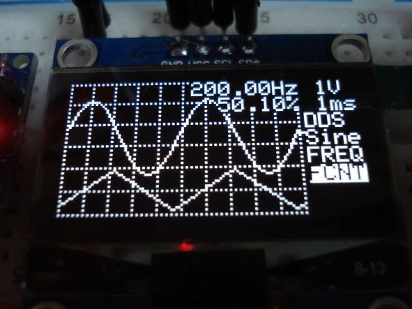

# ArduinoOLEDOscilloscope
Arduino OLED dual channel oscilloscope with 16Msps equivalent time sampling, Pulse Generator, DDS Function Generator and Frequency Counter

 

Schematics: 

Description is here https://projecthub.arduino.cc/siliconvalley4066/arduino-oled-dual-channel-oscilloscope-197863
